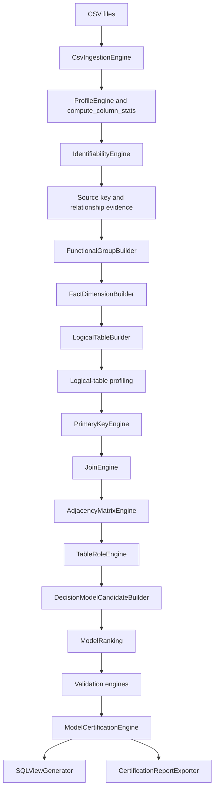

# Technical Architecture

Kawakiri is a staged pipeline. Each engine computes one category of evidence and stores
its result in ClickHouse metadata tables. This makes intermediate decisions observable
and allows individual commands to be rerun during development.

## Pipeline

## Processing stages

| Stage | Input | Output |
| --- | --- | --- |
| Ingestion | CSV files | Physical ClickHouse tables and ingestion metadata |
| Profiling | Physical columns | Cardinality, null ratio, entropy, variability, skewness |
| Identifiability | Column profiles | Identifier suitability scores |
| Source structure | Exact source keys and inclusion tests | Preliminary entity keys and relationships |
| Functional grouping | Raw profiles and FD tests | Non-overlapping groups and singletons |
| Logical modeling | Functional groups and profiles | Logical fact/dimension plans |
| Materialization | Logical plans | Logical ClickHouse tables |
| Key inference | Logical profiles | Simple and composite PK candidates |
| Join inference | Source columns and PK candidates | Directed joins with success ratios |
| Graph inference | Confirmed joins | Adjacency edges and table roles |
| Candidate modeling | Roles and graph | Star, snowflake, and constellation candidates |
| Validation | Candidate models | Structural, grain, semantic, and aggregation results |
| Certification | Ranking and validations | `VALID`, `WARNING`, or `INVALID` status |
| Generation | Best certified model | SQL views, JSON report, Mermaid schema |

## Functional grouping

`FunctionalGroupBuilder` tests dependencies of the form:

`D -> c`

where `D` is a simple or composite determinant and `c` is a candidate dependent
column. Candidate groups are scored and selected without column overlap. Remaining
columns are retained as singleton groups.

The source pass distinguishes two cases. In a flat event table, a determinant must
repeat and reduce the number of rows before its dependents can form an extracted
dimension. In an already-normalized source referenced by other tables, the complete
entity is retained and its key is chosen from incoming and outgoing relationship
evidence. This prevents an accidentally unique foreign key from replacing the key
owned by the table.

The builder also computes an iterative closure. If the current group columns determine
an unassigned column, the determinant is promoted to the complete current group before
the column is attached. This preserves the dependency that was actually tested.

`FactDimensionBuilder` does not enrich a dimension with unrelated source columns. It
classifies the functional groups already established by the grouping stage and builds
fact plans from grain, dimension keys, and statistical measure signals.

## Metadata separation

- `CH_DATABASE`: imported source tables, materialized logical tables, and generated views.
- `META_DB`: profiles, functional groups, logical-table definitions, keys, joins,
  adjacency edges, roles, model candidates, validation results, and certifications.

Computed metadata tables are cleared and rebuilt by their owning stage. Source tables
remain separate from this evidence.

## Table roles

Four final roles are used:

- `FACT`: an event or observation table with grain and measure evidence;
- `DIMENSION`: a descriptive lookup connected to facts or other dimensions;
- `ISOLATED`: a table with no confirmed edge;
- `UNKNOWN`: evidence is insufficient or contradictory.

The logical layer additionally uses `FACT_CANDIDATE`, `DIMENSION_CANDIDATE`, and
`UNKNOWN_CANDIDATE` before graph-based role inference. The neutral role prevents an
unresolved source from being discarded or forced into an unsupported interpretation.

## Model validation

Certification combines several independent checks:

1. structural topology and referential integrity;
2. deterministic fact granularity;
3. semantic homogeneity of facts and dimensions;
4. aggregation stability through inferred joins;
5. model ranking and coverage information.

An otherwise valid candidate with incomplete fact coverage receives a warning rather
than a full certification. Fact grains are reduced after the uniqueness test so the
reported grain contains no unnecessary columns.

Certification validates the implemented conditions. It cannot resolve every case of
non-identifiability when multiple structures are equally compatible with the data.
